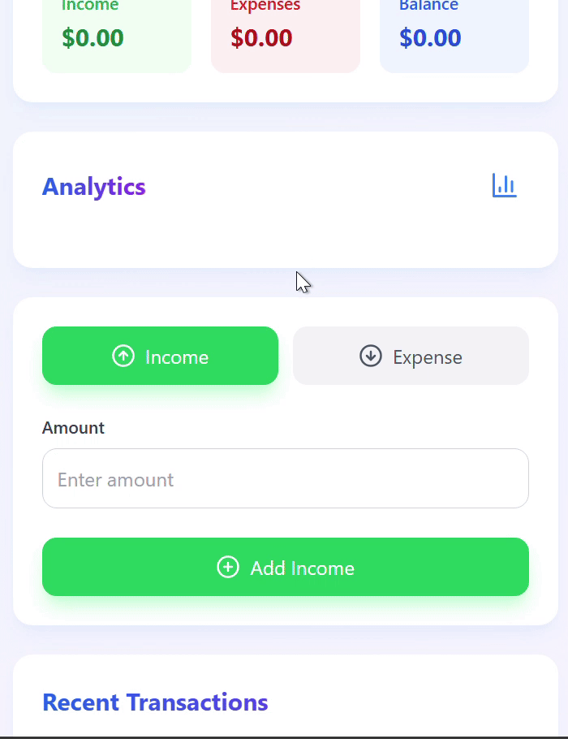

# 💸 React Finance Tracker

A simple, stylish personal finance tracker built with **React**, **TailwindCSS**, and **Chart.js**. It helps you track income and expenses monthly, visualize your financial data with charts, and stores everything locally on your browser.



## ✨ Features

- ✅ Add income and expenses with categories
- 📊 Bar chart for income vs expenses
- 🍩 Doughnut chart for expense categories
- 📅 Monthly summary with history
- ♻️ Reset month to start fresh (data archived)
- 💾 Persistent using `localStorage`
- 📱 Mobile-friendly UI

---

## 🛠️ Tech Stack

- [React](https://reactjs.org/)
- [Tailwind CSS](https://tailwindcss.com/)
- [Chart.js](https://www.chartjs.org/)
- [Lucide Icons](https://lucide.dev/icons)
- Vite (or CRA if you're using Create React App)

---

## 📦 Installation

1. **Clone the repo:**

```bash
git clone https://github.com/your-username/react-finance-tracker.git
cd react-finance-tracker
```

```bash
npm install
```

```bash
npm run dev
```
